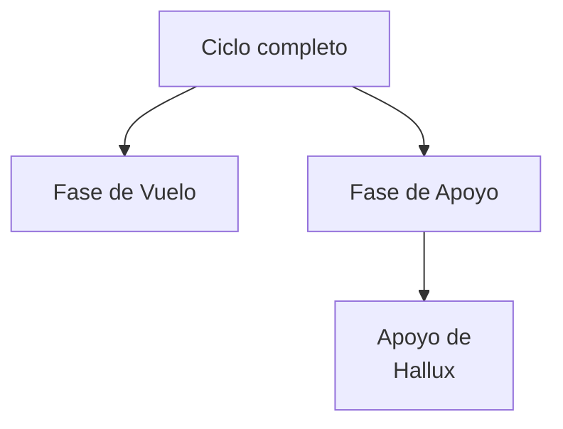

# Toolkit de Procesamiento de Señales

En este repositorio se desarrollaron las herramientas de software
necesarias para poder leer y pre-acondicionar las señales de la
base de datos pública de Camargo _et al_.

La clase principal que se desarrolla en el presente repositorio es
la clase **Senial**, la cual contiene pares de señales cotemporales
de altura de pie (medida en mm) y apertura angular (en grados) de 
alguna de las articulaciones del miembro inferior de individuos sanos
durante la marcha. Esto permite manipular a la par ambas señales,
las cuales constituyen la entrada a la red neuronal MINE con la cual 
se estimará la información mutua entre las mismas.

La clase **Senial** es capaz de extraer las distintas fases de la 
marcha de las señales a trabajar, a partir del conocimiento de 
los eventos de _Toe off_ y _Heel strike_ que se obtienen de la base
de datos. En el presente trabajo se consideraron las siguientes 
fases de la marcha: ciclo completo (_full cycle_), fase de 
vuelo (_swing_), fase de apoyo (_stance_) y fase de apoyo sin el
_foot flat_ (denominado en el proyecto como Apoyo H, y que en el
código lo encontrarán como fase nods).

La clase **Senial** también provee de los medios necesarios para
graficar la información extraída: curvas temporales y diagramas
de dispersión.
